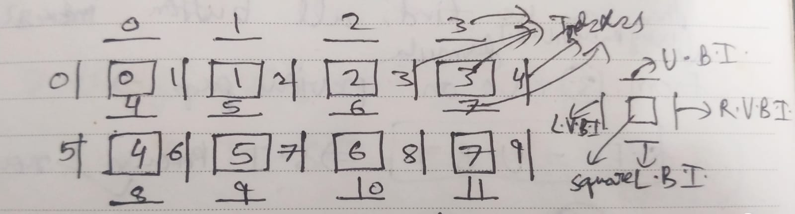
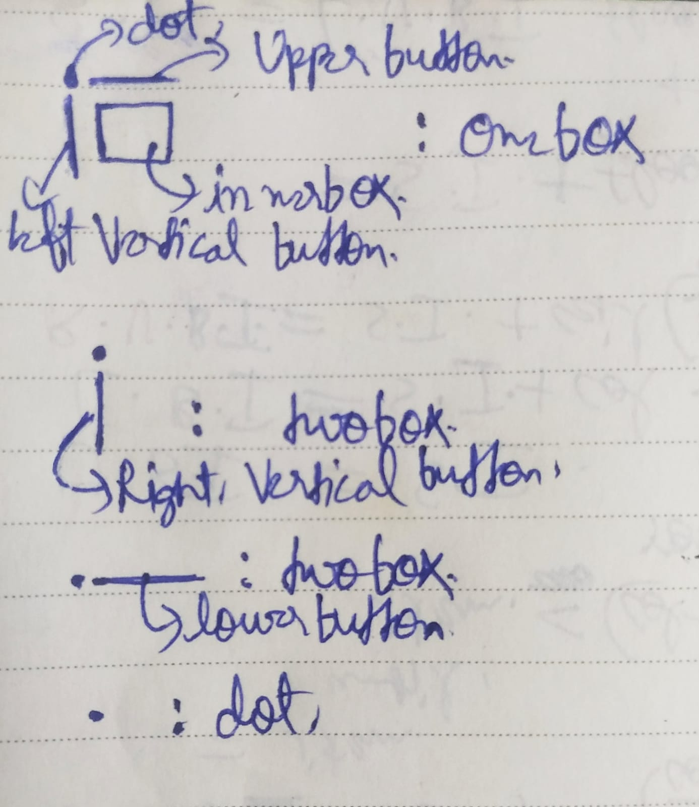

# Indexes used in grid rendering

## Conventions used

L.V.B.I. = Left Vertical button Index

R.V.B.I. = Right Vertical button Index

L.B.I. = Lower Button Index

U.B.I. = Upper Button Index

S.I. = square or inner box index

r = number of rows

c = number of columns

## What is grid made of and how it is rendered?

- Rows of grid except last row is made up of oneboxes in order from left to right

- Last column of each row except last row is made up of twoboxes which contains dot + right vertical button

- Last row is made up of twoboxes which contains dot + lower button

- Last element of grid is a dot

Grid is rendered using Boxes array which has oneboxes, twoboxes, dot as box items. There are separate arrays for innerboxes or squares inside onebox, horizontal buttons for lower, upper buttons, and vertical buttons for left and right vertical btns

## Formulas for L.V.B.I., R.V.B.I., L.B.I., U.B.I. and S.I.

<ul>
<li>S.I. = U.B.I.</li>
<li>L.B.I. = S.I. + c</li>
<li>L.V.B.I. = S.I. + floor(S.I./col)</li>
<li>R.V.B.I. = L.V.B.I. + 1 except for last column. For last column, R.V.B.I. = L.V.B.I.</li>
</ul>

## Relating L.V.B.I., R.V.B.I., L.B.I., U.B.I. and S.I. with Box-index

<strong>Box-index = L.V.B.I.</strong> for each row except last row in grid. Total number of box-indexes = (r + 1) * (c + 1)
, number of vertical buttons = r * (c + 1), number of horizontal buttons = (r + 1) * c.

<ul>
<li>Box-index = L.V.B.I. except for last row in grid</li>
<li>R.V.B.I. = Box-index + 1 except for last column. For last column, R.V.B.I. = Box-index.</li>
<li>S.I. = Box-index - floor(Box-index/(c+1))= U.B.I.</li>
<li>L.B.I. = Box-index - floor(Box-index/(c+1)) + c</li>
</ul>
